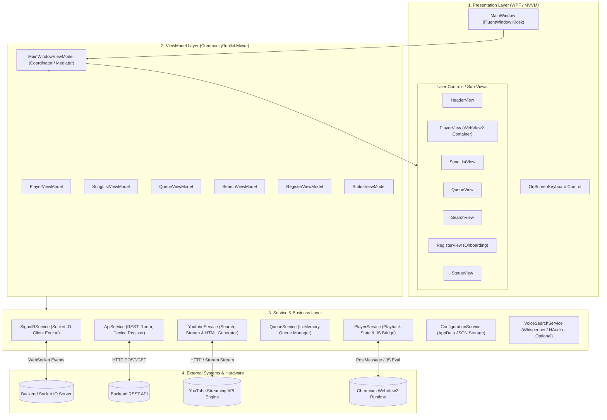
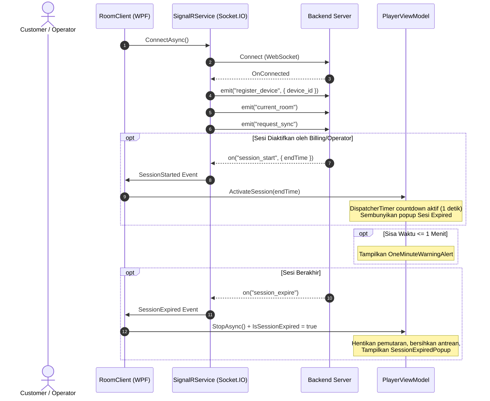
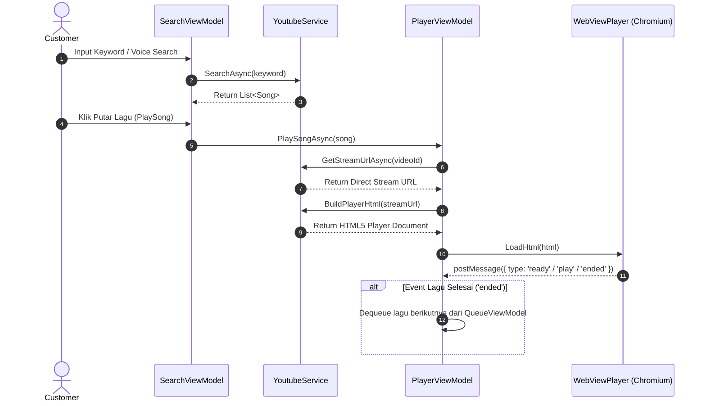

# 🏛️ Architecture Documentation - RoomClient

Dokumentasi arsitektur sistem **RoomClient** sebagai acuan teknis, referensi struktur kode, dan panduan pengembangan (*developer handbook*).

---

## 1. Ringkasan Sistem (*Executive Summary*)

**RoomClient** adalah aplikasi desktop berbasis **WPF (.NET 8)** bergaya **Kiosk Karaoke Room Client**. Aplikasi ini dirancang khusus untuk ruangan karaoke / kiosk interaktif dengan karakteristik:
- **Arsitektur MVVM (Model-View-ViewModel)** dengan *dependency injection* berbasis Microsoft Generic Host.
- **Komunikasi Real-time (Socket.IO WebSocket)** untuk koordinasi sesi dengan server billing/operator (*session start, extend, expire, sync*).
- **Integrasi REST API** untuk master data ruangan, registrasi perangkat, serta pencarian & pemutaran lagu YouTube.
- **Embedded Player Engine (Microsoft WebView2 / Chromium)** untuk rendering video HTML5 berkinerja tinggi dengan komunikasi *two-way JS bridge*.
- **Kiosk Hardening**: Intersepsi tombol sistem (`Alt+F4`, `Alt+Tab`), *fullscreen management*, keyboard virtual layar sentuh (*On-Screen Keyboard*), dan *failsafe exit*.

---

## 2. Diagram Arsitektur Tingkat Tinggi (*High-Level Architecture*)



---

## 3. Struktur Direktori & Komponen

```text
RoomClient/
├── Config/                  # Konfigurasi aplikasi & feature flags
│   ├── ApiSettings.cs
│   ├── ConfigurationProvider.cs
│   └── FeatureFlags.cs
├── Controls/                # Custom User Controls
│   ├── OnScreenKeyboard.xaml (.cs)
├── Core/                    # Core Abstractions & Data Transfer Objects
│   ├── Interfaces/          # Kontrak interface untuk seluruh service
│   │   ├── IApiService.cs
│   │   ├── IConfigService.cs
│   │   ├── IMicrophoneService.cs
│   │   ├── IPlayerService.cs
│   │   ├── IQueueService.cs
│   │   ├── ISignalRService.cs
│   │   ├── IVoiceSearchService.cs
│   │   └── IYoutubeService.cs
│   └── Models/              # Domain & DTO Models
│       ├── AppConfig.cs
│       ├── CurrentRoomPayload.cs
│       ├── QueueSong.cs
│       ├── RegisterClientRequest.cs
│       ├── Room.cs
│       ├── SessionStartedPayload.cs
│       ├── Song.cs
│       ├── YoutubeSearchResponse.cs
│       └── YoutubeStreamResponse.cs
├── Helpers/                 # XAML Value Converters & WebView Wrapper
│   ├── BoolToSessionStatusBrushConverter.cs
│   ├── EmptySearchResultConverter.cs
│   ├── PlayButtonContentConverter.cs
│   ├── SongHighlightConverter.cs
│   └── WebViewPlayer.cs     # Lifecycle & security wrapper WebView2
├── Models/                  # Resource model lokal (ggml Whisper AI)
├── Services/                # Implementasi Business Logic & External IO
│   ├── Api/                 # REST API Client (Backend)
│   ├── Configuration/       # Local AppData Config Manager
│   ├── Logging/             # Socket & Diagnostic Logger
│   ├── Player/              # Playback State & JS Command Dispatcher
│   ├── Queue/               # Antrean Lagu In-Memory
│   ├── SignalR/             # Socket.IO WebSocket Client
│   ├── Voice/               # Speech-to-Text Search (Whisper + NAudio)
│   └── Youtube/             # YouTube Search, Stream, and HTML Generator
├── ViewModels/              # MVVM ViewModels (CommunityToolkit.Mvvm)
│   ├── HeaderViewModel.cs
│   ├── MainWindowViewModel.cs
│   ├── PlayerViewModel.cs
│   ├── QueueViewModel.cs
│   ├── RegisterViewModel.cs
│   ├── SearchViewModel.cs
│   ├── SongListViewModel.cs
│   └── StatusViewModel.cs
├── Views/                   # XAML Views & User Controls
│   ├── Header/              # Top Bar & Room Status
│   ├── Player/              # Video Player Container
│   ├── Queue/               # Daftar Antrean Lagu
│   ├── Register/            # Form Registrasi Device
│   ├── Search/              # Input & Filter Pencarian
│   ├── SongList/            # Grid Hasil Pencarian Lagu
│   ├── Status/              # Status Koneksi & Log Diagnostic
│   └── Windows/             # MainWindow Fluent Window Kiosk
├── App.xaml (.cs)           # Generic Host & DI Composition Root
└── AppSettings.json         # Endpoint Configuration File
```

---

## 4. Rincian Layer Arsitektur

### A. Presentation Layer (Views & UI Engine)
- **Framework UI**: Menggunakan pustaka **WPF-UI (Fluent Design)** untuk styling modern dark theme, corner radius, dan animasi halus.
- **Kiosk Mode Hardening** (`MainWindow.xaml.cs`):
  - Mematikan resize window (`ResizeMode="NoResize"`, `Topmost="True"`).
  - Mengintersepsi tombol `PreviewKeyDown`: Menolak `Alt+F4`, membatasi `Alt+Tab`, dan menyediakan pintu darurat keluar teknisi via `Ctrl+Alt+Shift+Q`.
- **Dynamic Overlays**:
  - `SessionExpiredPopup`: Muncul otomatis saat sesi tidak aktif atau telah habis.
  - `WebSocketDisconnectedPopup`: Indikator berputar / peringatan terputus saat koneksi server offline.
  - `OneMinuteWarningAlert`: Peringatan floating merah saat sisa waktu sesi tinggal <= 1 menit.
  - `BottomPlayerBar`: Bar kontrol terapung (*floating player bar*) dengan kontrol Previous/Play/Pause/Next dan tombol Fullscreen.

### B. ViewModel Layer (MVVM)
- Dibangun dengan **CommunityToolkit.Mvvm** memanfaatkan *Source Generator* (`[ObservableProperty]`, `[RelayCommand]`).
- **Pola Coordinator / Mediator**:
  `MainWindowViewModel` bertindak sebagai pusat koordinasi yang menghubungkan dependensi antar ViewModel:
  ```csharp
  Search.Results = SongList.Results;
  Search.Player = Player;
  SongList.Player = Player;
  SongList.Queue = Queue;
  Queue.Player = Player;
  ```
- **UI Thread Safety**:
  Setiap event yang datang dari background thread (misalnya Socket.IO atau HttpClient) di-marshal secara aman ke UI thread melalui `Application.Current.Dispatcher.Invoke()`.

### C. Services & Integration Layer

| Service | Deskripsi & Tanggung Jawab |
|---|---|
| **SignalRService** (`ISignalRService`) | Mengelola koneksi WebSocket via library **SocketIOClient**. Melakukan auto-reconnect (50x percobaan), registrasi device otomatis (`register_device`), serta menangkap event `session_start`, `session_expire`, `session_extended`, dan `current_room`. |
| **PlayerService** (`IPlayerService`) | Mengelola status pemutaran (`Playing`, `Paused`, `Stopped`) dan bertindak sebagai jembatan yang mengirimkan instruksi JavaScript (`play`, `pause`, `stop`, `seek`) ke WebView2. |
| **YoutubeService** (`IYoutubeService`) | Menghubungi API YouTube untuk mengambil metadata lagu dan streaming URL. Membangun dokumen HTML5 `<video>` lengkap dengan CSS custom kontrol dan Javascript `postMessage` listener. |
| **ApiService** (`IApiService`) | Menangani HTTP REST request ke backend server untuk sinkronisasi daftar ruangan (`/api/rooms`) dan registrasi device client (`/api/devices/register`). |
| **ConfigurationService** (`IConfigService`) | Mengelola persistensi konfigurasi unik perangkat di `%APPDATA%\RoomClient\config.json` (Device UUID & status registrasi). |
| **QueueService** (`IQueueService`) | Menyimpan antrean lagu yang sedang menunggu untuk dimainkan. |
| **VoiceSearchService** (`IVoiceSearchService`) | *(Optional - Feature Flag)* Melakukan transkripsi perintah suara lokal menggunakan **Whisper.net** dan **NAudio** tanpa memerlukan koneksi internet tambahan. |

---

## 5. Alur Kerja Inti (*Core Execution Flows*)

### A. Lifecycle Sesi Ruangan (Socket.IO)



---

### B. Pencarian & Pemutaran Video (WebView2 Bridge)



---

## 6. Konfigurasi Sistem

### 1. `AppSettings.json` (Base Endpoints)
```json
{
  "ApiSettings": {
    "ServerAPI": "http://100.114.192.55:3000/api/",
    "YoutubeAPI": "http://100.114.192.55:8000",
    "WebSocket": "http://100.114.192.55:3000"
  }
}
```

### 2. Local Device Config (`%APPDATA%\RoomClient\config.json`)
```json
{
  "DeviceId": "3fa85f64-5717-4562-b3fc-2c963f66afa6",
  "IsRegistered": true
}
```

---

## 7. Panduan Standar Pengembangan (*Development Guidelines*)

1. **Prinsip MVVM**:
   - Dilarang keras menuliskan business logic atau direct service calls di dalam *code-behind* XAML (`.xaml.cs`).
   - Semua state UI wajib dibind ke ViewModel melalui `[ObservableProperty]`.
2. **Koneksi dan Threading**:
   - Selalu teruskan `CancellationToken` pada operasi asynchronous I/O.
   - Panggilan yang mengubah properti UI dari event listener background thread harus dibungkus dengan `Application.Current.Dispatcher.Invoke()`.
3. **Manajemen Lifecycle WebView2**:
   - Saat sesi berhenti (*session expired*) atau video dihentikan, selalu panggil `WebViewPlayer.Clear()` untuk menavigasi ke `about:blank`. Hal ini krusial untuk mematikan audio/video stream di level engine Chromium dan mencegah kebocoran memori.
4. **Ekstensi Service Baru**:
   - Definisikan interface baru di folder `Core/Interfaces/`.
   - Buat implementasi konkret di folder `Services/`.
   - Daftarkan service pada `IServiceCollection` di `App.xaml.cs`.
